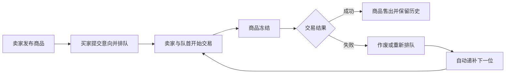

# OxStore

[](https://github.com/Wen5555/OxStore/actions/workflows/ci.yml)

**面向线下交付的轻量商品售卖系统。**

OxStore 将商品展示、购买意向排队和卖家交易管理连接起来：买家匿名登记意向，凭口令查询和管理自己的排队记录；卖家在后台发布商品、处理交易并查看完整历史。当前版本采用单卖家、逐件售卖模式，同一时间至多一件商品在售或冻结，付款与交货在线下完成。

[功能](#功能) · [快速开始](#快速开始) · [本地开发](#本地开发) · [技术栈](#技术栈) · [文档](#文档)

## 功能

| 买家前台 | 卖家后台 |
| --- | --- |
| 查看当前商品的名称、描述、图片和价格 | 登录后台、修改密码 |
| 无需注册，填写姓名和联系电话即可提交意向 | 发布商品、上传主图 |
| 提交成功后获得专属口令，查询状态与排队位置 | 查看当前商品及购买意向队列 |
| 排队期间凭口令修改信息、撤销意向 | 手动冻结或解冻商品，选择队首开始交易 |
| 失败后重新排队，继续使用原口令 | 确认成交，或将失败意向作废、重排到队尾 |
| 冻结期间查看商品及交易提示 | 自动递补下一位，查看历史商品、交易尝试和状态事件 |

系统保留首次意向提交时间和每次交易记录。商品售出后从前台下架，相关口令失效，卖家仍可查看历史。交易期间须先确认交易结果，再恢复售卖。

## 交易流程



失败后若没有待处理意向，商品恢复在售；重新排队的意向仍保留原口令。

## 快速开始

推荐使用 Docker Compose，统一启动前端、后端和数据库。需要安装 Docker，并启用 Compose。

### 1. 获取代码

```powershell
git clone https://github.com/Wen5555/OxStore.git
cd OxStore
Copy-Item .env.example .env
```

### 2. 配置环境

编辑 `.env`，填写以下配置：

| 变量 | 用途 |
| --- | --- |
| `DB_PASSWORD` | MySQL 密码 |
| `JWT_SECRET` | 卖家登录令牌签名密钥，至少32字节 |
| `TOKEN_LOOKUP_KEY` | 买家口令查询索引密钥，至少32字节 |
| `ADMIN_INITIAL_PASSWORD` | 首次创建卖家账号的密码，8–64位且含字母、数字和特殊字符 |

可以用 PowerShell 7 生成随机密钥；分别执行两次，为 JWT 和口令索引使用不同值：

```powershell
[Convert]::ToHexString([System.Security.Cryptography.RandomNumberGenerator]::GetBytes(32))
```

`.env` 已被 Git 忽略。`TOKEN_LOOKUP_KEY` 应保持稳定，以便已发放的买家口令继续可用。卖家账号创建后，重新启动不会重置其密码。

### 3. 启动

```powershell
docker compose up -d --build
```

| 入口 | 地址 |
| --- | --- |
| 买家前台 | [http://localhost/](http://localhost/) |
| 卖家登录 | [http://localhost/admin/login](http://localhost/admin/login) |

卖家用户名为 `admin`，首次密码使用刚填写的 `ADMIN_INITIAL_PASSWORD`。登录后可在后台修改密码。

Compose 为 MySQL 和上传图片配置持久化数据卷，空库首次启动会自动执行建表脚本。默认占用宿主机80和3306端口；已有数据库的升级步骤见[运行手册](docs/runbook.md#已有数据库升级)。

查看运行状态或停止服务：

```powershell
docker compose ps
docker compose logs --tail 100 backend
docker compose down
```

## 本地开发

需要 JDK 17、Node.js 20或更高版本、Maven 3.9或更高版本，以及 MySQL 8.0.16或更高版本。

### 初始化数据库

在项目根目录执行，`-p` 会交互询问数据库密码：

```powershell
mysql -uroot -p --default-character-set=utf8mb4 -e "CREATE DATABASE shop CHARACTER SET utf8mb4;"
mysql -uroot -p --default-character-set=utf8mb4 shop -e "source backend/src/main/resources/db/schema.sql;"
```

### 启动后端

将上表中的配置设为当前终端环境变量，PowerShell 写法为 `$env:变量名 = '配置值'`。本地 Spring Boot 读取环境变量，详细示例见[运行手册](docs/runbook.md#本地开发)。

```powershell
cd backend
mvn spring-boot:run
```

后端默认运行在 `http://localhost:8080`。数据库默认连接 `localhost:3306/shop`，用户名为 `root`；可通过 `DB_HOST`、`DB_PORT`、`DB_NAME`、`DB_USERNAME` 调整。

### 启动前端

在另一个终端执行：

```powershell
cd frontend
npm install
npm run dev
```

访问 [http://localhost:5173/](http://localhost:5173/)。Vite 会将 `/api` 请求代理到本地后端。

## 技术栈

| 层次 | 技术 |
| --- | --- |
| 前端 | React 18、TypeScript 5、Vite 5、Ant Design 5、React Router、axios |
| 后端 | Java 17、Spring Boot 3.2、Spring Data JPA、Spring Security、JWT |
| 数据库 | MySQL 8、InnoDB、utf8mb4 |
| 构建与部署 | Maven、npm、Docker Compose、Nginx |
| 测试与持续集成 | JUnit 5、Mockito、GitHub Actions |

前端通过 REST API 与后端通信。Docker 部署中，Nginx 提供前端静态资源并转发 `/api` 请求；后端通过 JPA 访问数据库。交易逻辑使用事务、行锁及唯一约束维护商品与意向状态的一致性。

## 项目结构

```text
OxStore/
├── backend/             # Spring Boot 服务、实体、建表和迁移脚本
├── frontend/            # React 买家前台与卖家后台
├── docs/                # 设计、运行、测试与协作文档
├── scripts/             # 数据库验证工具
├── docker-compose.yml   # 服务编排
├── .env.example         # 环境配置模板
└── .github/workflows/   # 持续集成
```

## 测试

后端测试与打包：

```powershell
cd backend
mvn test package
```

前端生产构建：

```powershell
cd frontend
npm run build
```

构建后端后，可在项目根目录运行数据库集成验证。需要 Python 3.10或更高版本、Docker 和 Java 17，脚本仅依赖 Python 标准库：

```powershell
python scripts/verify_database.py
```

验证覆盖建库、数据库约束、迁移、购买意向、交易历史和重启持久化，使用独立测试容器；实际结果与验证范围见[数据库验证报告](docs/test/db-validation.md)。

## 文档

- [项目 Wiki](https://github.com/Wen5555/OxStore/wiki)：需求、架构和协作资料
- [运行手册](docs/runbook.md)：环境配置、启动与数据升级
- [数据库设计](docs/design/database.md)：ER 图、数据字典及约束
- [交易与记录接口](docs/design/api.md)：接口约定和数据含义
- [测试计划](docs/test/test_plan.md)与[缺陷记录](docs/test/defects.md)

## 参与协作

欢迎通过 [Issue](https://github.com/Wen5555/OxStore/issues) 提交问题或建议，通过 Pull Request 提交改进。报告问题时请附上复现步骤、运行环境和预期行为；修改涉及交易规则或数据库时，同步更新文档和相关验证。
