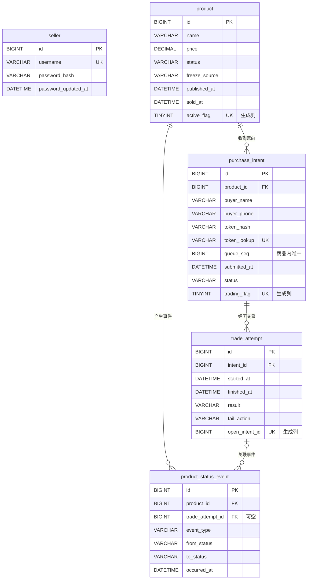

# OxStore 数据库设计与使用说明

维护人：张耀文（R5，软件2401，2412190723）
日期：2026-10-04
依据：主仓库基线 `8db4228`、当前 SQL/JPA 实现与课程第11组需求澄清。

## 1. 数据库概况

系统使用 MySQL **8.0.16+**、InnoDB 和 utf8mb4。`CHECK` 约束需要该版本及以上。当前数据库包含五张表；图片保存到上传目录，数据库仅保存路径，上传目录不是数据表。

| 表 | 作用 | 对应实体 |
| --- | --- | --- |
| seller | 卖家账号、密码哈希及改密时间 | Seller |
| product | 商品信息与当前状态 | Product |
| purchase_intent | 买家意向、当前排队序号与口令凭证 | PurchaseIntent |
| trade_attempt | 每次交易的开始、结束、结果与失败处理方式 | TradeAttempt |
| product_status_event | 历次发布、冻结、解冻和交易状态变化 | ProductStatusEvent |

建表脚本：[schema.sql](../../backend/src/main/resources/db/schema.sql)。字段映射位于 [entity](../../backend/src/main/java/com/team/shop/entity)，查询位于 [repository](../../backend/src/main/java/com/team/shop/repository)。

业务时间统一采用 `Asia/Shanghai`；`DATETIME(6)` 保存微秒精度的本地业务时间，本身不包含时区。应用和数据库环境应使用一致时区。

## 2. ER 图



`seller` 是独立账号表。当前单卖家模型没有 `product.seller_id`。事件可不关联交易尝试，例如发布和手动冻结；所有外键均未配置级联删除，历史记录应保留。

## 3. 数据字典

所有 `id` 均为 `BIGINT NOT NULL AUTO_INCREMENT` 主键。以下“必填”指数据库 `NOT NULL`，服务端的业务校验另行说明。

### 3.1 seller

| 字段 | 类型 | 必填 | 说明 |
| --- | --- | --- | --- |
| id | BIGINT | 是 | 主键 |
| username | VARCHAR(50) | 是 | 唯一用户名 |
| password_hash | VARCHAR(255) | 是 | BCrypt 密码哈希 |
| password_updated_at | DATETIME(6) | 否 | 最近改密时间 |

系统由 `DataInitializer` 初始化 `admin`；数据库唯一约束保证用户名不重复，并不单独限制账号行数。

### 3.2 product

| 字段 | 类型 | 必填 | 说明 |
| --- | --- | --- | --- |
| id | BIGINT | 是 | 主键 |
| name | VARCHAR(200) | 是 | 商品名称 |
| description | TEXT | 是 | 商品描述 |
| image_path | VARCHAR(500) | 是 | 商品图片路径 |
| price | DECIMAL(10,2) | 是 | 价格，CHECK 要求大于0 |
| status | VARCHAR(20) | 是 | ONLINE / RESTORED_ONLINE / FROZEN / SOLD |
| freeze_source | VARCHAR(20) | 否 | MANUAL / TRADE，未冻结时为空 |
| published_at | DATETIME(6) | 是 | 发布时间 |
| status_updated_at | DATETIME(6) | 否 | 最近状态变更时间 |
| sold_at | DATETIME(6) | 否 | 成交时间 |
| active_flag | TINYINT，STORED生成列 | 条件生成 | 活跃状态为1，SOLD为NULL；唯一索引 |

### 3.3 purchase_intent

| 字段 | 类型 | 必填 | 说明 |
| --- | --- | --- | --- |
| id | BIGINT | 是 | 主键 |
| product_id | BIGINT | 是 | 外键，关联商品 |
| buyer_name | VARCHAR(100) | 是 | 买家姓名；当前提交/修改接口最多20字 |
| buyer_phone | VARCHAR(20) | 是 | 联系电话；接口要求恰好11位数字 |
| token_hash | VARCHAR(255) | 否 | BCrypt口令哈希，意向结束后为空 |
| token_lookup | VARCHAR(64) | 否 | HMAC-SHA256查找摘要，唯一；旧有效口令可为空 |
| status | VARCHAR(20) | 是 | QUEUING / IN_TRANSACTION / SUCCESS / FAILED / CANCELLED / UNSOLD |
| submitted_at | DATETIME(6) | 是 | 首次提交时间，重排时保留 |
| queue_seq | BIGINT | 是 | 商品内唯一的排队序号；重排分配新序号 |
| updated_at | DATETIME(6) | 否 | 最近修改联系方式时间 |
| processed_at | DATETIME(6) | 否 | 最近意向状态处理时间 |
| trading_flag | TINYINT，STORED生成列 | 条件生成 | IN_TRANSACTION为1，其他为NULL；唯一索引 |

数据库姓名字段保留100字符容量，接口20字上限是更严格的业务规则，两者不必设置成相同长度。联系方式长度与合法状态主要由服务端校验，不能声称数据库已对这些规则全部配置CHECK。

### 3.4 trade_attempt

| 字段 | 类型 | 必填 | 说明 |
| --- | --- | --- | --- |
| id | BIGINT | 是 | 主键，前端确认结果时提交的tradeAttemptId |
| intent_id | BIGINT | 是 | 外键，关联意向 |
| started_at | DATETIME(6) | 是 | 本次开始交易时间 |
| finished_at | DATETIME(6) | 否 | 本次结束时间 |
| result | VARCHAR(10) | 否 | SUCCESS / FAILED；未结束时为空 |
| fail_action | VARCHAR(10) | 否 | REQUEUE / DISCARD；仅失败时有值 |
| open_intent_id | BIGINT，STORED生成列 | 条件生成 | 未结束时等于intent_id，否则NULL；唯一索引 |

完成约束要求：未结束时结果与失败动作均为空；结束后结果非空、结束时间不早于开始时间；成功时无失败动作，失败时必须指定REQUEUE或DISCARD。

### 3.5 product_status_event

| 字段 | 类型 | 必填 | 说明 |
| --- | --- | --- | --- |
| id | BIGINT | 是 | 主键 |
| product_id | BIGINT | 是 | 外键，关联商品 |
| trade_attempt_id | BIGINT | 否 | 外键，关联交易尝试 |
| event_type | VARCHAR(30) | 是 | PUBLISHED / MANUAL_FREEZE / MANUAL_UNFREEZE / TRADE_STARTED / TRADE_FAILED / TRADE_SUCCEEDED |
| from_status | VARCHAR(20) | 否 | 变更前商品状态；发布时为空 |
| to_status | VARCHAR(20) | 是 | 变更后商品状态 |
| freeze_source | VARCHAR(20) | 否 | 变更后冻结来源 |
| occurred_at | DATETIME(6) | 是 | 事件发生时间 |

失败后自动递补在同一事务中分别保存 `TRADE_FAILED` 和 `TRADE_STARTED`，所以恢复在售和再次冻结都可追溯。

## 4. 约束、索引与业务规则

| 机制 | 保证或用途 |
| --- | --- |
| uk_seller_username | 用户名唯一 |
| uk_product_active | 全系统至多一件活跃商品 |
| uk_intent_trading | 全系统至多一条交易中意向 |
| uk_intent_product_seq | (product_id, queue_seq)唯一 |
| uk_intent_token_lookup | 新口令索引摘要唯一，NULL可重复 |
| uk_attempt_open_intent | 每个意向至多一次未结束交易尝试 |
| idx_intent_product_status_seq | 按商品、状态查队列并按序号排序 |
| idx_attempt_intent_time | 按意向读取历次尝试 |
| idx_event_product_time / idx_event_attempt | 按商品时间线或交易尝试查事件 |

队列实际按 `(queue_seq, id)` 排序，当前位次通过仍在排队的意向实时计算；`queue_seq`不等于位次。重排只增加序号，首次提交时间不变。

Service 的 `@Transactional` 定义事务边界，商品行的悲观写锁串行化发布后状态操作与意向提交；唯一索引兜底。队首选择、跨表状态一致性和口令有效期还依赖业务事务，并非只靠单个SQL约束完成。

口令跟随意向生命周期：**REQUEUE保留原码；DISCARD、撤销、成交或商品售出使相关码失效**。本次已按[课程第11组9月28日澄清](https://github.com/sebestp/coursewise/wiki/需求澄清记录)修正重排清空凭证的行为。仅首次提交响应返回明文，数据库保存哈希与索引摘要。

旧版本已清空的口令凭证无法恢复，本次修正作用于之后发生的重排。

## 5. 首次建库

在项目根目录执行以下PowerShell命令，`-p`交互输入本地密码：

```powershell
mysql -uroot -p --default-character-set=utf8mb4 -e "CREATE DATABASE shop CHARACTER SET utf8mb4;"
mysql -uroot -p --default-character-set=utf8mb4 shop -e "source backend/src/main/resources/db/schema.sql;"
```

已有shop库时先确认它是否为空。`CREATE TABLE IF NOT EXISTS`不会更新旧表结构，不能代替迁移。

本地Spring Boot不会直接读取`.env`；启动前设置 `DB_HOST/DB_PORT/DB_NAME/DB_USERNAME/DB_PASSWORD/JWT_SECRET/TOKEN_LOOKUP_KEY/ADMIN_INITIAL_PASSWORD`。真实密码和密钥不写入Git或成果记录。

使用Docker Compose时，空MySQL数据卷自动导入同一schema。配置现有`.env.example`中的必填变量后运行 `docker compose up --build`。保留卷再次启动不会重复初始化。当前配置 `ddl-auto: none`、`sql.init.mode: never`，应用不会自动改表。

## 6. 已有库迁移

1. 停止业务写入；记录行数、状态分布和迁移时间。
2. 用`mysqldump`备份，并在独立副本完成恢复演练。PowerShell可使用`--result-file`保存SQL，避免输出重定向编码影响：

   ```powershell
   mysqldump -uroot -p --single-transaction --routines --triggers --default-character-set=utf8mb4 --result-file=shop-before-upgrade.sql shop
   ```

3. 旧三表库先结束全部交易中意向，再通过mysql客户端执行 [V2](../../backend/src/main/resources/db/migrations/V2__queue_history.sql)。不启用`--force`。
4. 已运行旧版V2的库按条件执行 [V3](../../backend/src/main/resources/db/migrations/V3__trade_attempt_completion_check.sql)；新库和修订后的V2已含严格约束。
5. 核对意向行数、中文、状态和首次时间，以及`queue_seq`无空/重复；配置`HISTORY_COMPLETE_SINCE`标明旧历史可能不完整。

MySQL DDL会隐式提交。V2若在前置检查拦截且尚未改表，可解决交易状态后重试；中途已改表时须核对结构及备份，不能直接重跑。旧版曾覆盖的首次时间和未记录的交易历史无法由迁移恢复。

备份应存放在受控位置，包含个人信息与哈希的数据文件不加入Git。回退应停写并恢复已演练的备份；直接启动旧程序继续写入会破坏新历史语义。

## 7. 验证入口与待同步事项

[数据库验证报告](../test/db-validation.md)列出本次实际结果；[验证脚本](../../scripts/verify_database.py)在专用MySQL容器运行，不连接现有业务库。

- 组长的旧架构需同步五表模型、queue_seq和重排保留口令；本页作为数据库实现说明，保留原架构作者署名。
- 备注字段是否纳入MVP仍需R1统一需求；本次未新增字段。
- 课程记录对交易中手动解冻有前后不同表述；本次沿用现有“交易中须先标记结果”的规则，交R1澄清。
