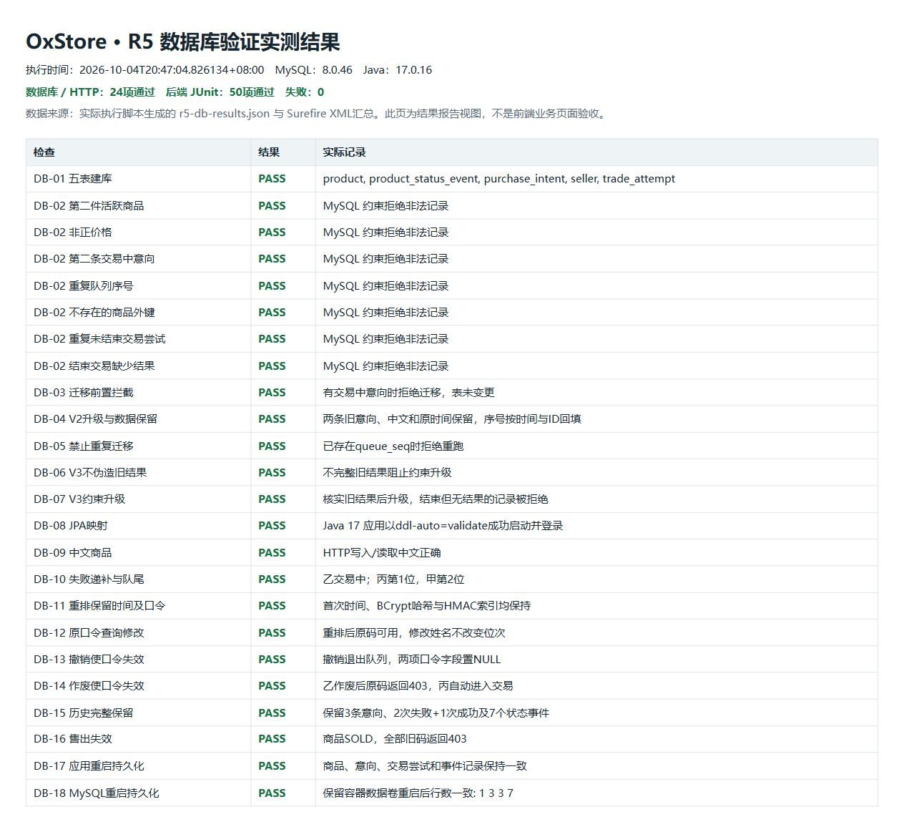

# R5 数据库验证报告

执行日期：2026-10-04（北京时间）
基线：`8db4228`，包含本轮REQUEUE口令修正。
执行方式：张耀文委托Codex辅助实现与实测；本人复核及课程答辩仍由张耀文完成。

## 1. 结果

**24项数据库/HTTP检查全部通过；50项后端JUnit测试通过，失败、错误、跳过均为0，打包成功。**

环境：Windows PowerShell7、Microsoft OpenJDK17.0.16、Maven3.9.12、Docker Engine29.2.1、独立MySQL **8.0.46**容器。应用以`ddl-auto=validate`启动，验证SQL表与JPA实体映射。数据库与应用均只绑定本机地址。

本次未使用已有shop库；测试凭据随机生成，未写入Git或证据。测试容器、专用数据卷和应用进程已清理。

证据：

- [数据库执行结果JSON](evidence/r5-db-results.json)：24条实际结果、information_schema字段快照及实际后台历史响应。
- [JUnit结果汇总](evidence/r5-unit-results.json)：从本轮Surefire XML提取的计数。
- 验证结果截图：本轮JSON执行结果的浏览器展示，见下方；它不是前端业务页面验收截图。

## 2. 实测项目

| 编号 | 验证内容 | 实际结果 |
| --- | --- | --- |
| DB-01 | 空库导入schema | 创建五张表，表名完整 |
| DB-02（7项） | 第二件活跃商品、非正价格、第二条交易中意向、重复队列序号、非法商品外键、重复未结束尝试、结束但无结果 | MySQL分别以唯一约束、外键或CHECK拒绝 |
| DB-03 | 带交易中意向迁移V2 | 改表前拒绝，queue_seq尚未出现 |
| DB-04 | 结束交易后迁移V2 | 两条旧意向的中文、电话、状态和原时间保持，序号为1/2 |
| DB-05 | 重复运行V2 | 明确拒绝，防止二次升级 |
| DB-06 | 旧版宽松CHECK允许缺结果记录后运行V3 | 前置检查拒绝升级，不补造结果 |
| DB-07 | 核实旧结果后运行V3 | 升级完成，再写结束但无结果的记录被拒绝 |
| DB-08 | SQL与JPA映射 | Java17应用validate启动、卖家登录成功 |
| DB-09 | 中文商品发布与读取 | 名称与描述正确，无乱码 |
| DB-10 | 甲/乙/丙排队，甲失败重排 | 乙进入交易；丙第1位、甲第2位 |
| DB-11 | 重排前后字段比较 | 首次提交时间、token_hash、token_lookup均保持 |
| DB-12 | 重排后凭原码查询与修改 | 查询成功，修改姓名后位次仍为2 |
| DB-13 | 重排买家主动撤销 | 退出队列，两个口令字段清空，旧码HTTP403 |
| DB-14 | 乙交易失败作废 | 原码HTTP403，丙自动递补 |
| DB-15 | 丙成交后后台读取历史 | 3条意向、3次尝试（2失败+1成功）、7个状态事件保留 |
| DB-16 | 商品成交后旧码查询 | 所有旧码HTTP403，凭证字段全部为空 |
| DB-17 | 应用停止并重新启动 | 后台商品、意向、尝试、事件响应逐项一致 |
| DB-18 | 保留测试容器卷重启MySQL | 商品/意向/尝试/事件行数仍为1/3/3/7 |

## 3. 复现

在项目根目录执行；将JAVA_HOME改为本机实际JDK17路径：

```powershell
$env:JAVA_HOME = 'C:\Users\Wen\.jdks\ms-17.0.16'
$env:PATH = "$env:JAVA_HOME\bin;$env:PATH"
$env:PYTHONIOENCODING = 'utf-8'
Push-Location backend
mvn test package
Pop-Location
python scripts/verify_database.py --java "$env:JAVA_HOME\bin\java.exe"
```

Python脚本只依赖标准库；需要Docker已启动，首次运行需取得`mysql:8.0`镜像。脚本为每次执行创建随机名称的容器，限定三个专用库：shop、legacy、schema_checks。legacy中的旧数据和宽松约束由脚本生成，迁移对比是隔离夹具验证。

本次Maven中央仓库出现证书错误，任务内临时使用阿里云public镜像取得相同版本依赖；临时settings位于被忽略的`backend/.work/`，没有修改全局Maven配置。

## 4. 范围与交接

本次结果证明上述数据库和HTTP场景。完整Compose发布、前端端到端UI、持续压测、正式部署环境和实际旧业务库迁移尚未执行。应用重启验证比较完整记录；MySQL容器重启验证比较行数，未将其扩大表述为所有重启场景均已验收。

本轮修复仅调整重排口令生命周期，现有schema与迁移脚本保持不变；额外增加终态清空凭证的JUnit回归。旧版本已经清空的口令无法恢复；本次保证之后的重排保留已有有效凭证。R1需将旧架构/SRS中“重排后口令失效”的条款同步为最新澄清，R2/R4可直接使用本脚本继续回归。备注字段和交易中手动解冻规则的需求分歧另交R1确认。

## 5. 验证结果截图


