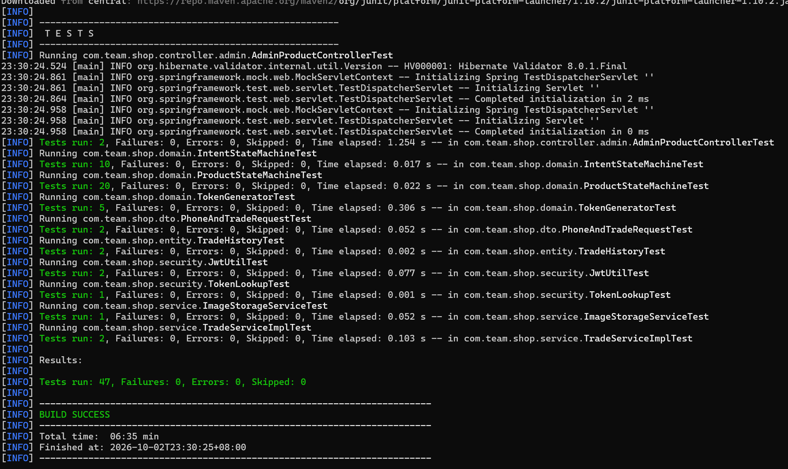
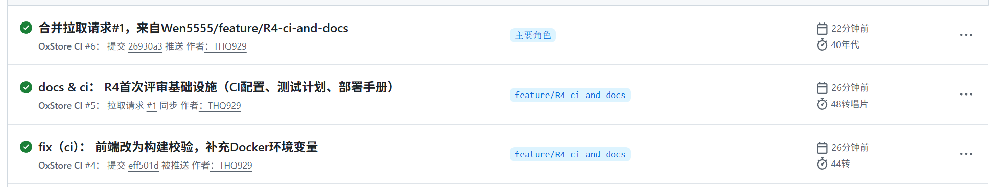
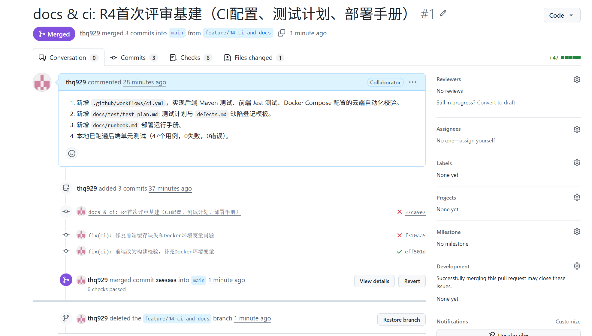

# OxStore 测试计划与报告 (v1.0)

## 1. 测试范围（基于需求表 REQ-001 至 REQ-040）
- **核心业务闭环（MVP核心）**：免注册商品浏览（REQ-025）、提交购买意向（REQ-024）、卖家登录后台（REQ-003）、单商品发布（REQ-006）、卖家冻结商品（REQ-027）、卖家确认成交（REQ-028）、确认失败并解冻（REQ-016）、售出后发布下一件（REQ-039）。
- **状态与并发（非功能/数据）**：商品状态机流转约束（REQ-029）、单商品售卖与并发唯一性（REQ-004）、系统异常处理与状态一致性（REQ-017）、重复意向提交拦截（REQ-020）。
- **边界与安全**：商品字段与价格边界校验（REQ-012）、图片上传与校验（REQ-009）、买家联系信息校验（REQ-019）、后台权限与会话隔离（REQ-031）。

## 2. 测试策略与工具链
| 测试类型 | 工具 | 关联需求 | 触发时机 |
| :--- | :--- | :--- | :--- |
| 后端单元测试 | JUnit 5 + Mockito | REQ-004, 012, 029 | 每次 Push / PR |
| 前端构建校验 | Node.js + npm | 全局 | 每次 Push / PR |
| 部署配置校验 | Docker Compose | DEL-04 | 每次 Push / PR |
| API 接口测试 | Postman / REST Assured | REQ-025, 024, 003, 006 | 联调阶段 |
| 状态机与并发测试 | JUnit + JMeter | REQ-004, 017, 029 | 版本发布前 |
| UI 界面测试 | Selenium | REQ-023, 036 | 联调阶段 |

## 3. 待澄清事项对测试的影响（Q01-Q12）
根据需求表，部分边界值尚未确认（如价格上限、冻结时长、图片大小等）。测试用例将暂按“建议值”编写（如价格0.01-999999.99，图片2MB），待 Q05/Q06 确认后修改断言。

## 4. 第一阶段测试进度
- **第1周**：搭建 CI 框架，跑通本地单测（47个用例）。
- **第2-3周**：补充基于 REQ-012（字段边界）、REQ-029（状态机）的 API 与并发测试用例。

## 5. 当前测试报告
- **本地后端单测**：`mvn test` 执行成功，47个测试用例全部通过。
- **云端 CI 流水线**：PR #1 中 6 checks passed，后端、前端、Docker 校验全绿，已合并 main。

